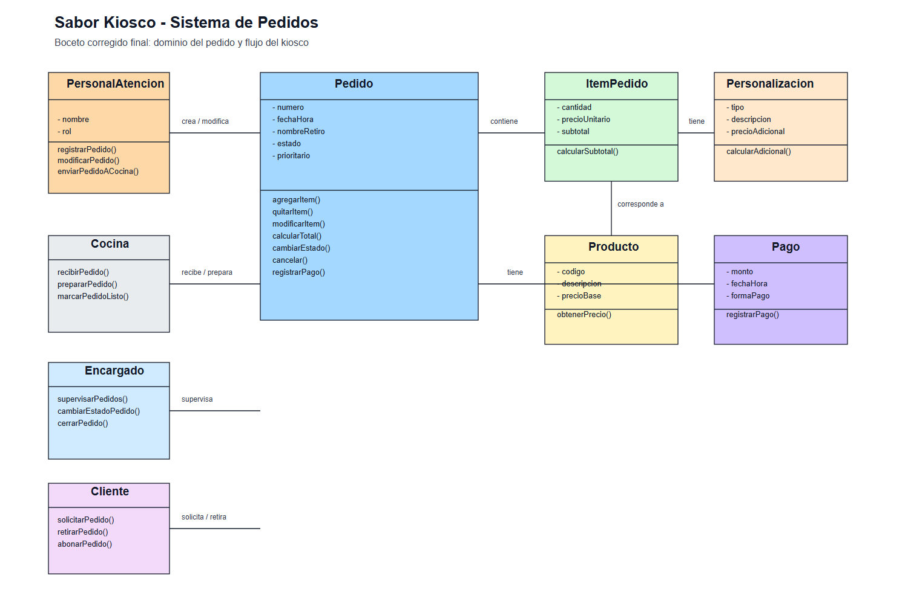

# Anexo - Introducción al Diseño Orientado a Objetos

*Es un concepto que se usa para referirse a una forma de crear software, mediante uno o más lenguajes de programación específicos (por ejemplo, C++ o Java).*

 *La Programación Orientada a Objetos busca estructurar el programa dividiéndolo en modelos de objetos reales o simulados que interactúan directamente entre sí.*

Las ventajas e importancia de este paradigma se basa en:
1. 🛡️ *Robustez y Seguridad del Sistema*

Se logra mediante encapsulación y ocultación de datos internos de los objetos; así se controla el acceso y las modificaciones a través de interfaces públicas (`get`/`set` o métodos específicos). Esto reduce errores y limita la superficie de cambios, aunque no sustituye controles de seguridad adicionales ni protege contra código con privilegios especiales.

2. 🔧 *Mantenibilidad a Largo Plazo*

Es la facilidad en el tiempo para corregir errores, realizar mejoras o adaptar el software sin alterar su funcionamiento general.

3. 📈 *Adaptabilidad y Extensibilidad en el Tiempo*

Los requisitos de un negocio son dinámicos y cambian de forma inevitable. La POO aborda esta realidad permitiendo que el software evolucione con facilidad.

## Los Cuatro Fundamentos de POO
*Explicar detalladamente el significado técnico de cada pilar e ilustrarlo de forma pragmática con analogías lógicas del negocio del Kiosco "Sabor" (sin necesidad de codificar en esta etapa):*

1. **Abstracción:** 
Proceso para reducir la complejidad del mundo real, enfocándose sólo en puntos relevantes y significativos para el sistema.

En SistemaPedidos, un ejemplo puede ser un alfajor, que tiene diferentes propiedades (peso, tamaño, color, gusto, etc.). Para el sistema, lo importante es la venta y facturación del mismo.

Atributos esenciales: `codigo`, `descripcion`, `precioBase`.

Métodos esenciales: `obtenerPrecio()`

2. **Encapsulamiento:** 
Consiste en agrupar los atributos de los datos con las funciones o métodos que actúan sobre los mismos.

En SistemaPedidos un ejemplo es el valor total de un pedido(montoTotal). Este valor numérico no debe ser manipulado.
Solo puede modificarse en caso de agregar o quitar productos dentro del mismo pedido. 

3. **Herencia:** 
Es el mecanismo estructural que permite organizar las clases en jerarquías.
 
Una clase derivada (hija) hereda y adquiere de forma automática todos los atributos y comportamientos (métodos) de una clase base (madre o superclase), posibilitando la reutilización del diseño y la extensión de comportamientos especializados sin necesidad de duplicar código.

Aplicación práctica en el Kiosco "Sabor": 
En el kiosco existen productos que requieren manipulación (productos elaborados como un sándwich) y productos comerciales directos (envasados como una gaseosa).
En lugar de diseñar dos clases independientes duplicando campos, creamos la superclase genérica Producto y hacemos que dos subclases específicas hereden de ella :

ProductoEnvasado hereda `codigo` y `descripcion`, y añade su propio atributo específico: `fechaVencimiento`.

ProductoElaborado hereda `codigo` y `descripcion`, y añade `tiempoPreparacion`.

4. **Polimorfismo:** 
Es la capacidad que poseen diferentes objetos pertenecientes a una misma jerarquía de clases para responder de manera distinta y personalizada a un mismo mensaje o llamada de método común.

Un ejemplo en SistemaPedidos:

Si queremos calcular el precio final de un producto envasado (gaseosa) ya lo tenemos configurado.

Si queremos calcular el precio final de un producto elaborado (sándwich), se suman varios factores más, como el precio del ingrediente, precio del empaque, el precio del tiempo de preparación.

# Requisitos iniciales del sistema

Cuaderno grupal de NotebookLM: https://notebook.google.com/notebook/4dab293b-0441-4235-a64d-10e886ddbb70

### Requisitos funcionales

*RF1 - Registrar pedido*  
El sistema debe permitir registrar un pedido con sus productos, cantidades y personalizaciones.

*RF2 - Identificar pedido para retiro*  
El sistema debe permitir identificar cada pedido mediante un número de pedido y un nombre o referencia de retiro.

*RF3 - Calcular total del pedido*  
El sistema debe calcular el total del pedido teniendo en cuenta los productos, cantidades y personalizaciones.

*RF4 - Registrar pago*  
El sistema debe permitir registrar el pago de un pedido y su forma de pago.

*RF5 - Enviar pedido a cocina*  
El sistema debe enviar automáticamente el pedido a cocina una vez registrado.

*RF6 - Consultar pedidos activos*  
El sistema debe permitir visualizar los pedidos activos y su estado actual.

*RF7 - Cambiar estado del pedido*  
El sistema debe permitir cambiar el estado de un pedido entre recibido, en preparación, listo y entregado.

*RF8 - Cancelar pedido*
El sistema debe permitir cancelar un pedido solo en estados recibido o en preparación; al cancelarse, el pedido pasa a estado cancelado, queda registrado en el historial y no aparece en la lista de pedidos activos.

*RF9 - Marcar pedido como prioritario*  
El sistema debe permitir marcar manualmente un pedido como prioritario.

*RF10 - Modificar pedido*  
El sistema debe permitir modificar un pedido mientras se encuentre en estado recibido.

*RF11 - Agregar o quitar productos*  
El sistema debe permitir agregar o quitar productos de un pedido mientras se encuentre en estado recibido.

*RF12 - Modificar personalizaciones*  
El sistema debe permitir agregar, quitar o modificar las personalizaciones de los productos de un pedido mientras se encuentre en estado recibido.

*RF13 - Registrar entrega del pedido*  
El sistema debe permitir registrar que un pedido listo fue entregado al cliente.

### Estados del pedido

- recibido: permitir modificar, agregar/quitar productos, cancelar y priorizar.
- en preparación: permitir priorizar y consultar; bloquear modificaciones.
- listo: permitir registrar entrega; bloquear modificaciones.
- entregado: solo consulta.
- cancelado: solo consulta histórica y no aparece en la lista de pedidos activos.

### Requisitos no funcionales

*RNF1 - Información actualizada*  
El sistema debe mantener la información de los pedidos actualizada para que el personal pueda consultar el mismo estado y la misma información del pedido.

*RNF2 - Consistencia de la información*  
El sistema debe evitar que se pierda o se duplique la información de los pedidos.

*RNF3 - Facilidad de uso*  
El sistema debe ser sencillo de utilizar para el personal del kiosco, permitiendo consultar y actualizar la información de los pedidos de forma clara.

*RNF4 - Integridad de los pedidos*  
El sistema debe conservar el historial completo de cada pedido cancelado para auditoría y no permitir su eliminación física del sistema.

*RNF5 - Comunicación entre mostrador y cocina*
El sistema debe comunicar a cocina la toma y las actualizaciones de un pedido, evitando que el personal dependa de avisos verbales para enterarse de los cambios.

*RNF6 - Inmutabilidad del precio histórico*
El precio asignado a un ítem en un pedido debe congelarse en el momento de la venta, garantizando que futuros cambios en el catálogo de productos no modifiquen pedidos pasados. 
 
*RNF7 - Encapsulamiento y protección de reglas del dominio*
Definición: El sistema debe garantizar que las validaciones de negocio, restricciones de edición y transiciones de estado estén encapsuladas internamente en las entidades del dominio (como Pedido), impidiendo que capas externas o la interfaz alteren la información o el estado interno sin ejecutar los métodos válidos.

*RNF8 - Extensibilidad y diseño modular*
Definición: El diseño arquitectónico y de dominio debe ser modular y extensible, permitiendo incorporar futuras funcionalidades (como la apertura de un segundo local, cobro por QR, programa de puntos o integración con WhatsApp) sin requerir reestructurar ni romper las entidades base del MVP.

*RNF9 - Confiabilidad y disponibilidad en horario operativo*
Definición: El sistema debe mantenerse disponible y estable durante la totalidad de los turnos de atención del local (martes a domingos de 12:00 a 15:00 y de 20:00 a 00:00), garantizando que no se interrumpa el registro ni la consulta de comandas durante las horas pico de servicio.

*RNF10 - Trazabilidad e identificación unívoca.*
Definición: Cada pedido debe contar con un identificador único generado de forma automática e inalterable por el sistema y asociarse a una referencia de retiro, garantizando la trazabilidad completa del pedido a lo largo de todo su ciclo de vida entre mostrador y cocina.

# CASOS DE USO

- Nombre del caso de uso: Registrar pedido.
    - Actor principal: Usuario de mostrador.
    - Descripción breve: Permite registrar un pedido con sus productos, cantidades, personalizaciones y una referencia de retiro para su preparación y entrega posterior.
    - Flujo principal de eventos:
        - Actor: Solicita registrar un nuevo pedido.
        - Sistema: Valida la disponibilidad del catálogo y crea la instancia del pedido.
        - Actor: Agrega productos, cantidades, personalizaciones y la referencia de retiro.
        - Sistema: Calcula el total y asigna el identificador del pedido.
        - Actor: Confirma el registro.
        - Sistema: Guarda el pedido en estado recibido, conserva el historial y envía la orden a cocina.
    - Precondiciones: Deben existir productos disponibles y el pedido no debe duplicar un identificador ya registrado.
    - Postcondiciones: Queda creado un pedido en estado recibido, con total calculado y con la notificación enviada a cocina.

- Nombre del caso de uso: Cobrar cuenta.
    - Actor principal: Usuario de mostrador.
    - Descripción breve: Permite registrar el pago de un pedido y emitir la comprobación correspondiente, manteniendo la trazabilidad del cobro.
    - Flujo principal de eventos:
        - Actor: Solicita cerrar la cuenta del pedido.
        - Sistema: Recupera el detalle del pedido y calcula el total a cobrar.
        - Actor: Confirma el medio de pago.
        - Sistema: Registra el pago y actualiza el estado del pedido según la regla de negocio.
        - Actor: Solicita la impresión del comprobante.
        - Sistema: Emite el ticket de cobro.
    - Precondiciones: El pedido debe existir y encontrarse en un estado habilitado para cobro.
    - Postcondiciones: Se registra el pago y el pedido queda finalizado o en estado cobrado según la regla del negocio.

- Nombre del caso de uso: Entregar pedido.
    - Actor principal: Usuario de mostrador.
    - Descripción breve: Permite localizar un pedido mediante su número de identificación y la referencia o nombre de retiro para atenderlo correctamente.
    - Flujo principal de eventos:
        - Actor: Informa el número del pedido y la referencia de retiro.
        - Sistema: Busca el pedido asociado y verifica la coincidencia entre los datos ingresados y el registro del pedido.
        - Actor: Solicita la consulta del pedido.
        - Sistema: Recupera el estado, los productos y la información relevante del pedido.
    - Precondiciones: El pedido debe estar registrado en el sistema.
    - Postcondiciones: El pedido queda identificado para consulta, actualización o entrega según su estado actual.

- Nombre del caso de uso: Cancelar pedido.
    - Actor principal: Usuario de mostrador.
    - Descripción breve: Permite cancelar un pedido solo si se encuentra en un estado habilitado, manteniendo su historial sin eliminarlo físicamente del sistema.
    - Flujo principal de eventos:
        - Actor: Consulta el pedido activo y verifica su estado.
        - Sistema: Valida que el pedido cumple las condiciones de cancelación.
        - Actor: Confirma la cancelación.
        - Sistema: Actualiza el estado a cancelado, lo excluye de los pedidos activos y conserva el registro histórico.
    - Precondiciones: El pedido debe encontrarse en estado recibido o en preparación.
    - Postcondiciones: El pedido queda en estado cancelado, no aparece en la vista de pedidos activos y permanece registrado para auditoría.

- Nombre del caso de uso: Preparar pedido.
    - Actor principal: Cocina.
    - Descripción breve: Permite recibir un pedido y actualizar su estado hasta dejarlo listo para entrega.
    - Flujo principal de eventos:
        - Actor: Recibe la notificación del pedido nuevo.
        - Sistema: Asigna el pedido a la cola de preparación.
        - Actor: Actualiza el pedido al estado en preparación.
        - Sistema: Registra el cambio de estado.
        - Actor: Marca el pedido como listo para entrega.
        - Sistema: Actualiza el estado a listo y notifica al mostrador.
    - Precondiciones: El pedido debe existir y estar en estado recibido o en preparación.
    - Postcondiciones: El pedido queda en estado listo y queda disponible para ser entregado o consultado por el personal.

- Nombre del caso de uso: Priorizar pedido.
    - Actor principal: Usuario de mostrador.
    - Descripción breve: Permite marcar un pedido activo como prioritario para indicar su urgencia dentro de la preparación.
    - Flujo principal de eventos:
        - Actor: Consulta la lista de pedidos activos.
        - Sistema: Verifica que el pedido se encuentre en un estado habilitado para prioridad.
        - Actor: Solicita marcar el pedido como prioritario.
        - Sistema: Actualiza el atributo de prioridad y reorganiza la atención del pedido.
        - Actor: Confirma la operación.
    - Precondiciones: El pedido debe existir y encontrarse en estado recibido o en preparación.
    - Postcondiciones: El pedido queda marcado como prioritario y se atiende con mayor relevancia dentro de la gestión de pedidos.

### Boceto inicial del diseño de clases

El siguiente diagrama representa el boceto inicial de clases del sistema, incluyendo las clases principales identificadas, sus atributos, métodos y relaciones.

[Ver boceto inicial en línea](https://imgur.com/a/x6o1R6X)