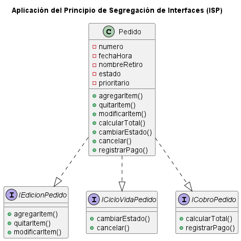

# Principio de Segregación de Interfaces (ISP)

## Propósito y Tipo del Principio SOLID

El Principio de Segregación de Interfaces (ISP) es uno de los principios SOLID y tiene como propósito reducir dependencias innecesarias entre los clientes y las interfaces que utilizan. Su regla central establece que ningún cliente debería verse obligado a depender de métodos que no necesita.

El principio busca evitar las denominadas interfaces "gordas" o poco especializadas, que reúnen operaciones correspondientes a distintos propósitos y fuerzan a sus clientes o clases implementadoras a depender de funcionalidades ajenas a su responsabilidad.

Para evitar este problema, ISP propone diseñar interfaces cohesivas y especializadas, agrupando operaciones que se utilizan juntas y separando aquellas que responden a responsabilidades diferentes. De esta manera, cada cliente puede depender únicamente del contrato que necesita, disminuyendo el acoplamiento y facilitando el mantenimiento y la evolución del sistema.

## Motivación

En el boceto inicial del sistema, la clase `Pedido` concentra operaciones correspondientes a distintos aspectos de la gestión de un pedido. Entre ellas se encuentran la edición de sus ítems (`agregarItem()`, `quitarItem()` y `modificarItem()`), la administración de su ciclo de vida (`cambiarEstado()` y `cancelar()`) y las operaciones vinculadas al cobro (`calcularTotal()` y `registrarPago()`).

La presencia de estos métodos en una misma clase concreta no constituye por sí sola una violación del Principio de Segregación de Interfaces. El ISP se centra en las dependencias de los clientes respecto de las operaciones expuestas por un contrato.

El problema surgiría si todas las capacidades de `Pedido` se expusieran mediante una única interfaz general, por ejemplo `IGestionPedido`. En ese caso, un cliente que necesitara únicamente modificar el contenido de un pedido también dependería de operaciones relacionadas con el cobro o con su ciclo de vida, aunque no las utilizara.

Para evitar este tipo de dependencia innecesaria, se propone segregar las operaciones en contratos especializados según su finalidad: edición del pedido, gestión de su ciclo de vida y cobro. De esta manera, el diseño permite que los clientes dependan únicamente del conjunto de operaciones necesario para su función, siempre que dichas dependencias se realicen a través de las interfaces especializadas.

La división propuesta se basa en responsabilidades ya presentes en el diseño. Las operaciones de edición modifican el contenido del pedido y están restringidas por su estado; las operaciones de cambio de estado y cancelación pertenecen a las reglas de su ciclo de vida; y el cálculo del total junto con el registro del pago forman parte del proceso de cobro. Por lo tanto, la segregación se realiza a partir de grupos cohesivos existentes y no mediante la incorporación de responsabilidades nuevas.

## Explicación de Interfaces

En diseño orientado a objetos, una interfaz representa un contrato que define un conjunto de operaciones disponibles para sus clientes. Especifica qué servicios o comportamientos pueden utilizarse, sin exponer los detalles internos de cómo se implementan.

En una interfaz explícita, como las que pueden representarse mediante la construcción `interface` en lenguajes orientados a objetos, se declaran las operaciones que las clases concretas se comprometen a implementar. De esta manera, se separa la especificación del comportamiento de su implementación concreta.

En el contexto del Principio de Segregación de Interfaces, el concepto de interfaz también puede entenderse en un sentido más general como el conjunto de operaciones públicas que una clase o módulo expone a sus clientes. El ISP establece que esos clientes no deberían depender de operaciones que no utilizan.

Por este motivo, las interfaces deben diseñarse de forma cohesiva y especializada, agrupando operaciones que responden a una misma finalidad y separando aquellas que se utilizan de manera independiente.

En SistemaPedidos, se propone aplicar este criterio sobre las responsabilidades actualmente presentes en `Pedido`. En lugar de exponer todas sus capacidades mediante un único contrato general, se plantean interfaces específicas para la edición del pedido, la gestión de su ciclo de vida y el cobro. Así, cada cliente puede depender únicamente del contrato necesario para su función.

## Estructura de Clases

El siguiente diagrama UML representa la aplicación del Principio de Segregación de Interfaces sobre la clase `Pedido`. Se proponen tres interfaces especializadas según los grupos de responsabilidades identificados en el diseño actual: edición del pedido, gestión de su ciclo de vida y cobro.

[Ver código fuente del diagrama PlantUML](../../diagramas/01-diagrama-clases/01-solid-04-isp.puml)

## Justificación Técnica

El diagrama UML propuesto muestra a la clase `Pedido` realizando tres interfaces especializadas: `IEdicionPedido`, `ICicloVidaPedido` e `ICobroPedido`. Estas interfaces no forman parte del boceto inicial, sino que constituyen la propuesta de aplicación del Principio de Segregación de Interfaces desarrollada a partir de las responsabilidades ya existentes en `Pedido`.

`IEdicionPedido` agrupa `agregarItem()`, `quitarItem()` y `modificarItem()`, operaciones relacionadas con la modificación del contenido del pedido. Estas responsabilidades ya se encuentran presentes en el diseño y están sujetas a las reglas de edición definidas por el estado del pedido.

`ICicloVidaPedido` contiene `cambiarEstado()` y `cancelar()`. Ambas operaciones intervienen en la administración del ciclo de vida del pedido y deben respetar las transiciones y restricciones establecidas por las reglas del dominio.

`ICobroPedido` reúne `calcularTotal()` y `registrarPago()`. Se propone esta agrupación porque ambas operaciones aparecen vinculadas dentro del flujo de cobro del sistema. Sin embargo, `calcularTotal()` también participa en otros momentos del ciclo del pedido, por lo que esta agrupación se plantea como un contrato especializado para el contexto de cobro y no implica que ambas operaciones deban utilizarse siempre de manera conjunta.

La clase concreta `Pedido` conserva los comportamientos definidos en el boceto inicial. La aplicación del ISP no requiere dividirla en nuevas clases, sino proponer contratos especializados que agrupen operaciones según su finalidad.

De esta manera se evita proponer una única interfaz general, como `IGestionPedido`, que reúna edición, ciclo de vida y cobro. Un contrato de ese tipo podría obligar a un cliente a depender de operaciones que no necesita. Las interfaces propuestas permiten que futuros clientes del diseño dependan solamente del contrato correspondiente a la capacidad que utilizan.

En el modelo actual no se identifica de forma inequívoca una clase cliente que consuma el contrato completo `ICobroPedido`. Por este motivo, el diagrama no incorpora una dependencia desde un cliente específico hacia esa interfaz. La reducción efectiva del acoplamiento dependerá de que las dependencias de los clientes se establezcan mediante las interfaces especializadas y no directamente sobre todas las operaciones de la clase concreta `Pedido`.