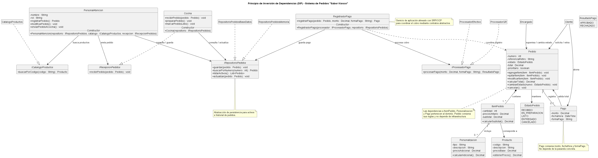

# Anexo 05: Principio de Inversión de Dependencias (DIP)

## Propósito y Tipo del Principio SOLID
El Principio de Inversión de Dependencias (DIP) es un principio de **diseño estructural y arquitectónico**. Su propósito principal es desacoplar los módulos de alto nivel (la lógica de negocio o de dominio) de los módulos de bajo nivel (los detalles de implementación, como persistencia o pasarelas de pago). 

DIP establece dos reglas fundamentales:
1. Los módulos de alto nivel no deben depender de módulos de bajo nivel; ambos deben depender de abstracciones.
2. Las abstracciones no deben depender de los detalles; los detalles deben depender de las abstracciones.

## Motivación
En el diseño inicial, clases de alto nivel como `PersonalAtencion` o `Cocina` dependían directamente de implementaciones concretas de almacenamiento o procesamiento de pagos. Esto generaba un fuerte acoplamiento, imposibilitaba las pruebas unitarias aisladas y requería modificar la lógica de negocio ante cualquier cambio tecnológico en la infraestructura.

Al aplicar DIP, introducimos interfaces que actúan como contratos neutros, invirtiendo la dirección de la dependencia para garantizar un sistema extensible y mantenible.

## Explicación de Clases Abstractas e Interfaces
- **Interfaces:** Definen un contrato puro de comportamiento sin implementación ni estado propio. Se utilizaron para definir la persistencia (`IRepositorioPedidos`), el catálogo (`ICatalogoProductos`), la recepción de comandas (`IRecepcionPedidos`) y la pasarela de pagos (`IProcesadorPago`), asegurando un desacoplamiento total.
- **Clases Abstractas:** Se emplean cuando existe código compartido o un estado común entre varias clases derivadas dentro de una misma jerarquía de herencia.

## Estructura de Clases
El diseño refactorizado introduce interfaces estratégicas para desacoplar las responsabilidades de infraestructura y servicios:

1. **`IRecepcionPedidos`:** Define el contrato para la recepción de comandas. `Cocina` implementa este contrato, permitiendo que en el futuro se sustituya por una pantalla o impresora sin modificar `PersonalAtencion`.
2. **`ICatalogoProductos`:** Permite consultar los datos de productos disponibles sin acoplar la atención al cliente a una tecnología específica de catálogo.
3. **`IRepositorioPedidos`:** Abstrae las operaciones de persistencia (guardar, buscar, listar, actualizar) de los pedidos. Puede ser implementado por repositorios en memoria, bases de datos SQL o NoSQL.
4. **`IProcesadorPago`:** Contrato que aísla la lógica externa del cobro (`ProcesadorEfectivo`, `ProcesadorQR`), impidiendo que las entidades de dominio dependan de pasarelas de pago.

### Diagrama de clases

- [Ver el diagrama en detalle (PNG)](../../diagramas/01-diagrama-clases/01-solid-05-dip.png)
- [Ver el código PlantUML](../../diagramas/01-diagrama-clases/01-solid-05-dip.puml)

## Justificación Técnica
La aplicación de DIP mediante Inyección de Dependencias por constructor garantiza que:
- La lógica del kiosco (`Pedido`, `PersonalAtencion`, `Cocina`, `RegistradorPago`) dependa de contratos abstractos y no de implementaciones concretas.
- Se puedan realizar pruebas unitarias utilizando dobles de prueba (*mocks/stubs*) sin necesidad de una base de datos ni una pasarela de pago real.
- El sistema cumpla con el principio OCP (Open/Closed), permitiendo agregar nuevos procesadores de pago o repositorios sin alterar el código existente.